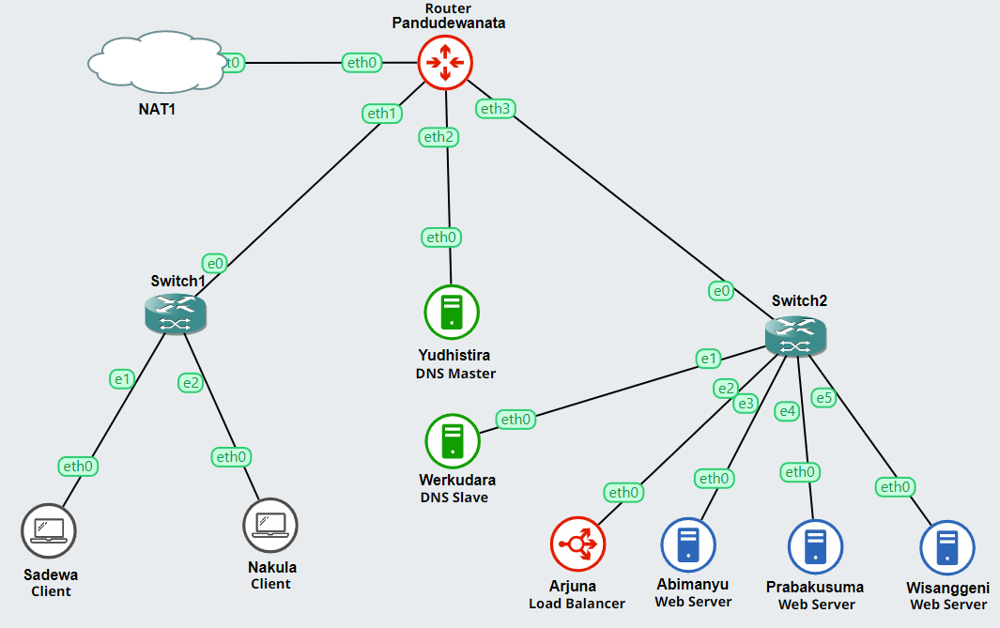

# Jarkom-Modul-2-E01-2023

## 1. 
### ***Buatlah topologi sesuai pembagian kelompok masing-masing***

### Topology


### Network Config
<ins>Pandudewanata</ins>

```
auto eth0
iface eth0 inet dhcp

auto eth1
iface eth1 inet static
	address 10.37.1.1
	netmask 255.255.255.0

auto eth2
iface eth2 inet static
	address 10.37.2.1
	netmask 255.255.255.0

auto eth3
iface eth3 inet static
	address 10.37.3.1
	netmask 255.255.255.0
```

<ins>Sadewa</ins>
```
auto eth0
iface eth0 inet static
	address 10.37.1.2
	netmask 255.255.255.0
	gateway 10.37.1.1
```

<ins>Nakula</ins>
```
auto eth0
iface eth0 inet static
	address 10.37.1.3
	netmask 255.255.255.0
	gateway 10.37.1.1
```

<ins>Yudhistira</ins>
```
auto eth0
iface eth0 inet static
	address 10.37.2.2
	netmask 255.255.255.0
	gateway 10.37.2.1
```

<ins>Werkudara</ins>
```
auto eth0
iface eth0 inet static
	address 10.37.3.2
	netmask 255.255.255.0
	gateway 10.37.3.1
```

<ins>Arjuna</ins>
```
auto eth0
iface eth0 inet static
	address 10.37.3.3
	netmask 255.255.255.0
	gateway 10.37.3.1
```

<ins>Abimanyu</ins>
```
auto eth0
iface eth0 inet static
	address 10.37.3.4
	netmask 255.255.255.0
	gateway 10.37.3.1
```

<ins>Prabakusuma</ins>
```
auto eth0
iface eth0 inet static
	address 10.37.3.5
	netmask 255.255.255.0
	gateway 10.37.3.1
```

<ins>Wisanggeni</ins>
```
auto eth0
iface eth0 inet static
	address 10.37.3.6
	netmask 255.255.255.0
	gateway 10.37.3.1
```

### .bashrc
Routing setting dan instalasi dependencies diletakkan pada .bashrc masing-masing node

Untuk dependencies tiap node kurang lebih seperti berikut:

* DNS (Yudhistira dan Werkudara):	
	* Bind9
* Client (Nakula dan Sadewa):
	* dnsutils
	* lynx
* Load Balancer (Arjuna):
	* nginx
* Worker (Abimanyu, Prabakusuma, Wisanggeni):
	* nginx
	* php
	* php-fpm
	* git
* Tambahan Abimanyu:
	* apache2

## 2. 
### ***Buatlah website utama pada node arjuna dengan akses ke arjuna.yyy.com dengan alias www.arjuna.yyy.com dengan yyy merupakan kode kelompok.***

### Konfigurasi pada DNS Master (Yudhistira)
Pertama buat file config untuk domain arjuna seperti berikut:
```bash
;
; BIND data file for local loopback interface
;
$TTL    604800
@       IN      SOA     arjuna.e01.com. root.arjuna.e01.com. (
                     2023101201         ; Serial
                            604800         ; Refresh
                             86400         ; Retry
                           2419200         ; Expire
                            604800 )       ; Negative Cache TTL
;
@       IN      NS      arjuna.e01.com.
@       IN      A       10.37.3.3       ; IP Arjuna
www     IN      CNAME   arjuna.e01.com.
```

Kemudian tambahkan zone pada `named.conf.local` untuk file config yang sudah dibuat
```bash
zone "arjuna.e01.com" {
        type master;
        file "/etc/bind/e01/arjuna.e01.com";
};
```

Restart bind9
```bash
service bind9 restart
```
### Konfiguerasi pada Client (Nakula, Sadewa)

arahkan nameserver dalam file `/etc/resolv.conf` menuju ip DNS Master
```bash
echo "nameserver 10.37.2.2       # IP Yudhistira" > /etc/resolv.conf
```

### Bukti pengecekan:


## 3. 
### ***Dengan cara yang sama seperti soal nomor 2, buatlah website utama dengan akses ke abimanyu.yyy.com dan alias www.abimanyu.yyy.com***

### Konfigurasi pada DNS Master (Yudhistira)
Pertama buat file config untuk domain abimanyu seperti berikut:
```bash
;
; BIND data file for local loopback interface
;
$TTL    604800
@       IN      SOA     abimanyu.e01.com. root.abimanyu.e01.com. (
                     2023101201         ; Serial
                         604800         ; Refresh
                          86400         ; Retry
                        2419200         ; Expire
                         604800 )       ; Negative Cache TTL
;
@               IN      NS      abimanyu.e01.com.
@               IN      A       10.37.3.4       ; IP Abimanyu
www             IN      CNAME   abimanyu.e01.com.
```

Kemudian tambahkan zone pada `named.conf.local` untuk file config yang sudah dibuat
```bash
zone "abimanyu.e01.com" {
        type master;
        file "/etc/bind/e01/abimanyu.e01.com";
};
```

Restart bind9
```bash
service bind9 restart
```

### Bukti pengecekan:


## 4. 
### ***Kemudian, karena terdapat beberapa web yang harus di-deploy, buatlah subdomain parikesit.abimanyu.yyy.com yang diatur DNS-nya di Yudhistira dan mengarah ke Abimanyu.***

Tambahkan konfigurasi berikut pada file config abimanyu:
```bash
parikesit       IN      A       10.37.3.4       ; IP Abimanyu
www.parikesit   IN      CNAME   parikesit.abimanyu.e01.com.
```

Restart bind9
```bash
service bind9 restart
```

### Bukti pengecekan


## 5. 
### ***Buat juga reverse domain untuk domain utama. (Abimanyu saja yang direverse)***

Pertama, buat file config untuk reverse domain abimanyu seperti berikut:
```bash
;
; BIND data file for local loopback interface
;
$TTL    604800
@       IN      SOA     abimanyu.e01.com. root.abimanyu.e01.com. (
                     2023101201         ; Serial
                         604800         ; Refresh
                          86400         ; Retry
                        2419200         ; Expire
                         604800 )       ; Negative Cache TTL
;
3.37.10.in-addr.arpa.   IN      NS      abimanyu.e01.com.
4                       IN      PTR     abimanyu.e01.com.
```

Kemudian tambahkan zone pada `named.conf.local` untuk file config yang sudah dibuat
```bash
zone "3.37.10.in-addr.arpa" {
        type master;
        file "/etc/bind/e01/3.37.10.in-addr.arpa";
};
```

Restart bind9
```bash
service bind9 restart
```

### Bukti pengecekan:


## 6. 
### ***Agar dapat tetap dihubungi ketika DNS Server Yudhistira bermasalah, buat juga Werkudara sebagai DNS Slave untuk domain utama.***

### Konfigurasi pada DNS Master (Yudhistira)
Ubah zone abimanyu pada `/etc/bind/named.conf.local` menjadi seperti berikut:
```bash
zone "abimanyu.e01.com" {
        type master;
		notify yes;
		also-notify { 10.37.3.2; };
		allow-transfer { 10.37.3.2; };
        file "/etc/bind/e01/abimanyu.e01.com";
};
```

Kemudian restart bind9
```bash
service bind9 restart
```

### Konfigurasi pada DNS Slave (Werkudara)
Tambahkan zone baru untuk domain abimanyu bertipe slave pada file `/etc/bind/named.conf.local`
```bash
zone "abimanyu.e01.com" {
        type slave;
        masters { 10.37.2.2; };
        file "/var/lib/bind/abimanyu.e01.com";
};
```

Kemudian restart bind9
```bash
service bind9 restart
```

### Konfiguerasi pada Client (Nakula, Sadewa)

tambahkan nameserver dengan ip DNS slave pada file `/etc/resolv.conf`
```bash
echo "nameserver 10.37.3.2       # IP Werkudara" >> /etc/resolv.conf
```

### Bukti pengecekan:

Untuk pengecekan, matikan DNS master lalu ping salah satu domain


## 7. 
### ***Seperti yang kita tahu karena banyak sekali informasi yang harus diterima, buatlah subdomain khusus untuk perang yaitu baratayuda.abimanyu.yyy.com dengan alias www.baratayuda.abimanyu.yyy.com yang didelegasikan dari Yudhistira ke Werkudara dengan IP menuju ke Abimanyu dalam folder Baratayuda.***

### Konfigurasi pada DNS Master (Yudhistira)
Ubah zone abimanyu pada `/etc/bind/named.conf.local` menjadi seperti berikut:
```bash
zone "abimanyu.e01.com" {
        type master;
		allow-transfer { 10.37.3.2; };
        file "/etc/bind/e01/abimanyu.e01.com";
};
```
Kemudian, Tambahkan konfigurasi berikut pada file config abimanyu
```bash
ns1             IN      A       10.37.3.4       ; IP Abimanyu
baratayuda      IN      NS      ns1
```

Restart bind9
```bash
service bind9 restart
```

### Konfigurasi pada DNS Slave (Werkudara)
Pertama, buat file config untuk subdomain baratayuda seperti berikut:
```bash
;
; BIND data file for local loopback interface
;
$TTL    604800
@       IN      SOA     baratayuda.abimanyu.e01.com. root.baratayuda.abimanyu.e01.com. (
                     2023101201         ; Serial
                         604800         ; Refresh
                          86400         ; Retry
                        2419200         ; Expire
                         604800 )       ; Negative Cache TTL
;
@       IN      NS      baratayuda.abimanyu.e01.com.
@       IN      A       10.37.3.4       ; IP Abimanyu
www     IN      CNAME   baratayuda.abimanyu.e01.com.
```
Kemudian, tambahkan zone untuk subdomain baratayuda pada `/etc/bind/named.conf.local` untuk file config yang sudah dibuat
```bash
zone "baratayuda.abimanyu.e01.com" {
        type master;
        file "/etc/bind/Baratayuda/baratayuda.abimanyu.e01.com";
};
```

Restart bind9
```bash
service bind9 restart
```

### Bukti pengecekan:


## 8. 
### ***Untuk informasi yang lebih spesifik mengenai Ranjapan Baratayuda, buatlah subdomain melalui Werkudara dengan akses rjp.baratayuda.abimanyu.yyy.com dengan alias www.rjp.baratayuda.abimanyu.yyy.com yang mengarah ke Abimanyu.***

### Konfigurasi pada DNS Slave (Werkudara)

Tambahkan konfigurasi berikut pada file config baratayuda
```bash
rjp     IN      A       10.37.3.4       ; IP Abimanyu
www.rjp IN      CNAME   rjp.baratayuda.abimanyu.e01.com.
```

Kemudian restart bind9
```bash
service bind9 restart
```

### Bukti pengecekan:


## 9. 
### ***Arjuna merupakan suatu Load Balancer Nginx dengan tiga worker (yang juga menggunakan nginx sebagai webserver) yaitu Prabakusuma, Abimanyu, dan Wisanggeni. Lakukan deployment pada masing-masing worker.***

### Konfigurasi pada worker (Prabakusuma, Abimanyu, Wisanggeni)

Pertama, clone repository ini, untuk mendapatkan resource web yang akan dideploy
```bash
git clone "https://github.com/H-mD/Jarkom-Modul-2-E01-2023.git"
```
Copy resource web arjuna kedalam folder `/var/www/`
```bash
cp -r /root/Jarkom-Modul-2-E01-2023/resources/arjuna.yyy.com /var/www/arjuna.e01
```
Kemudian, buat file config nginx baru pada `/etc/nginx/sites-available/`
```bash
server {

        listen xxxx;

        root /var/www/arjuna.e01;

        index index.php index.html index.htm;
        server_name _;

        location / {
                try_files $uri $uri/ /index.php?$query_string;
        }

        # pass PHP scripts to FastCGI server
        location ~ \.php$ {
                include snippets/fastcgi-php.conf;
                fastcgi_pass unix:/var/run/php/php7.2-fpm.sock;
        }

        location ~ /\.ht {
                deny all;
        }

        error_log /var/log/nginx/e01_error.log;
        access_log /var/log/nginx/e01_access.log;
}
```
> Pada bagian Listen, xxxx berupa port sesuai worker <br>
> _Prabakusuma: 8001_ <br>
> _Abimanyu: 8002_ <br>
> _Wisanggeni: 8003_


Buat symlink untuk file config pada `sites-available` dengan file config pada `sites-enabled`
```bash
ln -s /etc/nginx/sites-available/e01 /etc/nginx/sites-enabled
```

Untuk memastikan request diarahkan pada web yang benar, hapus file config default, kemudian restart php-fpm
```bash
rm -rf /etc/nginx/sites-enabled/default
service php7.2-fpm restart
service php7.2-fpm start
```

Restart nginx
```bash
service nginx restart
```

### Bukti pengecekan:


## 10. 
### ***Kemudian gunakan algoritma Round Robin untuk Load Balancer pada Arjuna. Gunakan server_name pada soal nomor 1. Untuk melakukan pengecekan akses alamat web tersebut kemudian pastikan worker yang digunakan untuk menangani permintaan akan berganti ganti secara acak. Untuk webserver di masing-masing worker wajib berjalan di port 8001-8003.***

### Konfigurasi pada Load Balancer (Arjuna)
Buat file config nginx load balancer baru pada `/etc/nginx/sites-available/`
```bash
upstream myweb  {
        server 10.37.3.5:8001; #IP Prabakusuma
        server 10.37.3.4:8002; #IP Abimanyu
        server 10.37.3.6:8003; #IP Wisanggeni
}

server {
        listen 80;
        server_name arjuna.e01.com www.arjuna.e01.com;

        location / {
                proxy_pass http://myweb;
        }
}
```
> * Default algoritma yang digunakan upstream adalah Round Robin <br> <br>
> * server_name diisikan domain arjuna sehingga pada pengecekan akan mengakses domain arjuna bukan ip worker lagi

Kemudian, buat symlink untuk file config pada `sites-available` dengan file config pada `sites-enabled`
```bash
ln -s /etc/nginx/sites-available/e01 /etc/nginx/sites-enabled
```

Restart nginx
```bash
service nginx restart
```

### Bukti pengecekan:


## 11. 
### ***Selain menggunakan Nginx, lakukan konfigurasi Apache Web Server pada worker Abimanyu dengan web server www.abimanyu.yyy.com. Pertama dibutuhkan web server dengan DocumentRoot pada /var/www/abimanyu.yyy***

### Konfigurasi pada Abimanyu

Pertama, copy resource web abimanyu kedalam foder `/var/www`
```bash
cp -r /root/Jarkom-Modul-2-E01-2023/resources/abimanyu.yyy.com /var/www/abimanyu.e01
```

Setelah itu, buat file config apache2 baru pada `/etc/apache2/sites-available/`
```bash
<VirtualHost *:80>

        ServerAdmin webmaster@localhost
		DocumentRoot /var/www/abimanyu.e01
		ServerName abimanyu.e01.com
		ServerAlias www.abimanyu.e01.com
		
		<Directory /var/www/abimanyu.e01>
			Require expr %{HTTP_HOST} == "abimanyu.e01.com" || %{HTTP_HOST} == "www.abimanyu.e01.com"
		</Directory>

        ErrorLog ${APACHE_LOG_DIR}/error.log
        CustomLog ${APACHE_LOG_DIR}/access.log combined

</VirtualHost>
```
> Require expr.... digunakan agar request dari domain selain abimanyu tidak dapat mengakses web ini

Kemudian, hapus file config default dan aktifkan file config baru
```bash
rm -rf /etc/apache2/sites-enabled/000-default.conf
a2ensite abimanyu.e01.conf
```

Reload dan Restart apache2
```bash
service apache2 reload
service apache2 restart
```

### Bukti pengecekan:


## 12. 
### ***Setelah itu ubahlah agar url www.abimanyu.yyy.com/index.php/home menjadi www.abimanyu.yyy.com/home.***

### Konfigurasi pada Abimanyu

Tambahkan konfigurasi berikut kedalam virtual host abimanyu pada config file abimanyu
```bash
Alias "/home" "/var/www/abimanyu.e01/index.php/home"
```

Kemudian restart apache2
```bash
service apache2 restart
```

### Bukti pengecekan:


## 13. 
### ***Selain itu, pada subdomain www.parikesit.abimanyu.yyy.com, DocumentRoot disimpan pada /var/www/parikesit.abimanyu.yyy***

### Konfigurasi pada Abimanyu

Pertama, copy resource web parikesit kedalam foder `/var/www`
```bash
cp -r /root/Jarkom-Modul-2-E01-2023/resources/parikesit.abimanyu.yyy.com /var/www/parikesit.abimanyu.e01
```
Kemudian, Tambahkan konfigurasi virtual host baru untuk parikesit pada file config abimanyu
```bash
<VirtualHost *:80>
        ServerAdmin webmaster@localhost
        DocumentRoot /var/www/parikesit.abimanyu.e01
        ServerName parikesit.abimanyu.e01.com
        ServerAlias www.parikesit.abimanyu.e01.com

        <Directory /var/www/parikesit.abimanyu.e01>
                Require expr %{HTTP_HOST} == "parikesit.abimanyu.e01.com" || %{HTTP_HOST} == "www.parikesit.abimanyu.e01.com"
        </Directory>

        ErrorLog ${APACHE_LOG_DIR}/error.log
        CustomLog ${APACHE_LOG_DIR}/access.log combined

</VirtualHost>
```
> Require expr.... digunakan agar request dari domain selain parikesit tidak dapat mengakses web ini

Restart apache2
```bash
service apache2 restart
```

### Bukti pengecekan:


## 14. 
### ***Pada subdomain tersebut folder /public hanya dapat melakukan directory listing sedangkan pada folder /secret tidak dapat diakses (403 Forbidden).***

### Konfigurasi pada Abimanyu

Tambahkan konfigurasi berikut kedalam virtual host parikesit pada config file abimanyu
```bash
<Directory /var/www/parikesit.abimanyu.e01/public>
	Options +Indexes
</Directory>

<Directory /var/www/parikesit.abimanyu.e01/secret>
	Deny from All
</Directory>
```
> Options +Indexes sebenarnya tidak perlu karena semua folder sudah enable directory listing secara default <br> <br>
> Secret tidak menggunakan -Indexes karena terdapat file index.php sehingga tidak akan mendapatkan 403 kecuali dengan Deny From All


Kemudian restart apache2
```bash
service apache2 restart
```

### Bukti pengecekan:


## 15. 
### ***Buatlah kustomisasi halaman error pada folder /error untuk mengganti error kode pada Apache. Error kode yang perlu diganti adalah 404 Not Found dan 403 Forbidden.***

### Konfigurasi pada Abimanyu

Tambahkan konfigurasi berikut kedalam virtual host parikesit pada config file abimanyu
```bash
IndexIgnore error

<Directory /var/www/parikesit.abimanyu.e01/error>
	Options -Indexes
</Directory>

ErrorDocument 403 /error/403.html
ErrorDocument 404 /error/404.html
```
> IndexIgnore dan Options -Indexes digunakan agar folder error tidak dapat diakses secara langsung oleh client

Kemudian restart apache2
```bash
service apache2 restart
```

### Bukti pengecekan:


## 16. 
### ***Buatlah suatu konfigurasi virtual host agar file asset www.parikesit.abimanyu.yyy.com/public/js menjadi www.parikesit.abimanyu.yyy.com/js***

### Konfigurasi pada Abimanyu

Tambahkan konfigurasi berikut kedalam virtual host parikesit pada config file abimanyu
```bash
Alias "/js" "/var/www/parikesit.abimanyu.e01/public/js"
```

Kemudian restart apache2
```bash
service apache2 restart
```

### Bukti pengecekan:


## 17. 
### ***Agar aman, buatlah konfigurasi agar www.rjp.baratayuda.abimanyu.yyy.com hanya dapat diakses melalui port 14000 dan 14400.***

### Konfigurasi pada Abimanyu

Pertama, copy resource web rjp.baratayuda kedalam foder `/var/www`
```bash
cp -r /root/Jarkom-Modul-2-E01-2023/resources/rjp.baratayuda.abimanyu.yyy.com /var/www/rjp.baratayuda.abimanyu.e01
```

Karena port yang akan digunakan adalah 1400 dan 1440 (bukan default port http) maka perlu ditambahkan konfigurasi berikut pada file `/etc/apache2/ports.conf`
```bash
Listen 14000
Listen 14400
```
Kemudian, Tambahkan konfigurasi virtual host baru untuk rjp.baratayuda pada file config abimanyu
```bash
<VirtualHost *:14000 *:14400>
        ServerAdmin webmaster@localhost
        DocumentRoot /var/www/rjp.baratayuda.abimanyu.e01
        ServerName rjp.baratayuda.abimanyu.e01.com
        ServerAlias www.rjp.baratayuda.abimanyu.e01.com

        <Directory /var/www/rjp.baratayuda.abimanyu.e01>
                Require expr %{HTTP_HOST} == "rjp.baratayuda.abimanyu.e01.com:14000" || %{HTTP_HOST} == "www.rjp.baratayuda.abimanyu.e01.com:14000" || %{HTTP_HOST} == "rjp.baratayuda.abimanyu.e01.com:14400" || %{HTTP_HOST} == "www.rjp.baratayuda.abimanyu.e01.com:14400"
        </Directory>

        ErrorLog ${APACHE_LOG_DIR}/error.log
        CustomLog ${APACHE_LOG_DIR}/access.log combined

</VirtualHost>
```
> Require expr.... digunakan agar request dari domain selain rjp.baratayuda tidak dapat mengakses web ini

Restart apache2
```bash
service apache2 restart
```

### Bukti pengecekan:


## 18. 
### ***Untuk mengaksesnya buatlah autentikasi username berupa “Wayang” dan password “baratayudayyy” dengan yyy merupakan kode kelompok. Letakkan DocumentRoot pada /var/www/rjp.baratayuda.abimanyu.yyy.***

### Konfigurasi pada Abimanyu

Pertama, siapkan folder untuk menyimpan file user
```bash
mkdir /etc/apache2/passwd
```

Untuk membuat user dan passwordnya menggunakan command htpasswd
```bash
htpasswd -c -b "/etc/apache2/passwd/passwords" "Wayang" "baratayudaE01"
```

Kemudian, tambahkan konfigurasi berikut kedalam virtual host rjp.baratayuda pada config file abimanyu
```bash
<Directory /var/www/rjp.baratayuda.abimanyu.e01>
	AuthType Basic
	AuthName "E01"
	AuthUserFile /etc/apache2/passwd/passwords
	Require user Wayang
</Directory>
```
> Menggunakan Require user agar autentikasi hanya valid untuk user Wayang

Restart apache2
```bash
service apache2 restart
```

### Bukti pengecekan:


## 19. 
### ***Buatlah agar setiap kali mengakses IP dari Abimanyu akan secara otomatis dialihkan ke www.abimanyu.yyy.com (alias)***

### Konfigurasi pada Abimanyu

Nyalakan mod rewrite pada apache2 untuk keperluan redirect
```bash
a2enmod rewrite
```

Kemudian, Tambahkan konfigurasi virtual host baru untuk ip server (10.37.3.4) pada file config abimanyu
```bash
<VirtualHost *:80>
        ServerName 10.37.3.4
        RewriteEngine On
        RewriteCond %{HTTP_HOST} ^10\.37\.3\.4*$
        RewriteRule ^(.*) http://www.abimanyu.e01.com [L,R=301]
</VirtualHost>
```

Restart apache2
```bash
service apache2 restart
```

### Bukti pengecekan:


## 20. 
### ***Karena website www.parikesit.abimanyu.yyy.com semakin banyak pengunjung dan banyak gambar gambar random, maka ubahlah request gambar yang memiliki substring “abimanyu” akan diarahkan menuju abimanyu.png.***

### Konfigurasi pada Abimanyu

Agar dapat menggunakan .htaccess, tambahkan konfigurasi berikut kedalam virtual host parikesit pada config file abimanyu
```bash
<Directory "/var/www/parikesit.abimanyu.e01">
	AllowOverride All
</Directory>
```

Kemudian, buat file .htacess baru dan letakkan pada folder yang menyimpan gambar `/var/www/parikesit.abimanyu.e01/public/images/`
```bash
RewriteEngine On
RewriteBase /
RewriteCond %{REQUEST_URI} .*abimanyu.*\.(jpg|png|webp)$
RewriteRule ^.*$ public/images/abimanyu.png [L,R=301]
```
> Request yang diklasifikasikan sebagai gambar adalah .jpg, .png, dan .webp

Restart apache2
```bash
service apache2 restart
```

### Bukti pengecekan:

